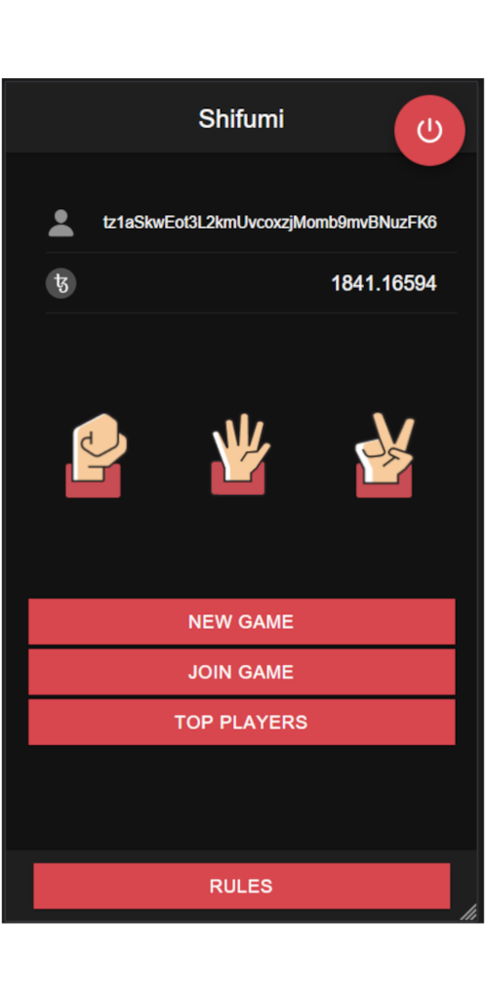
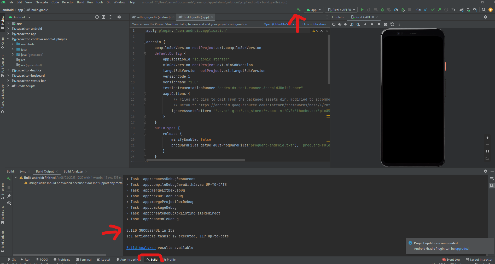
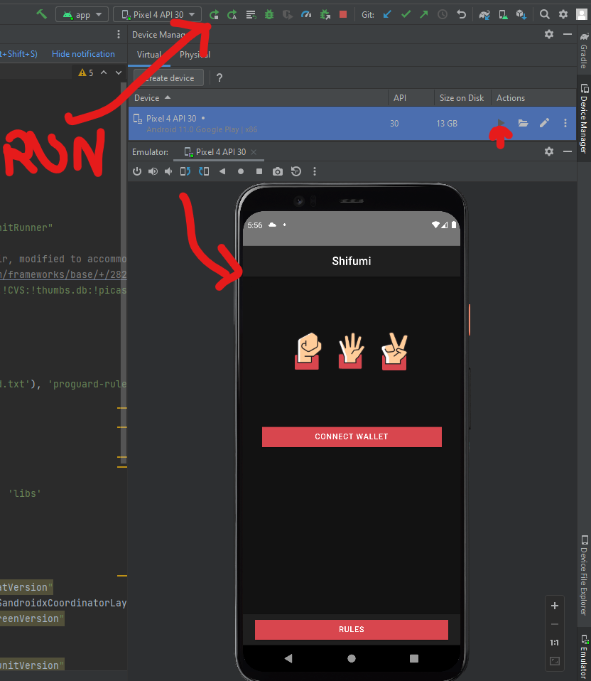
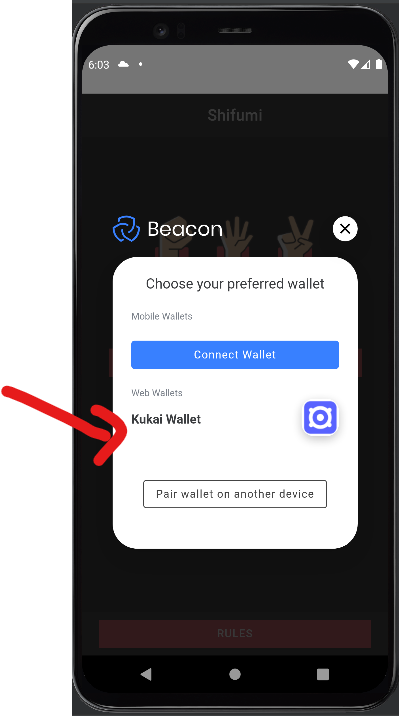
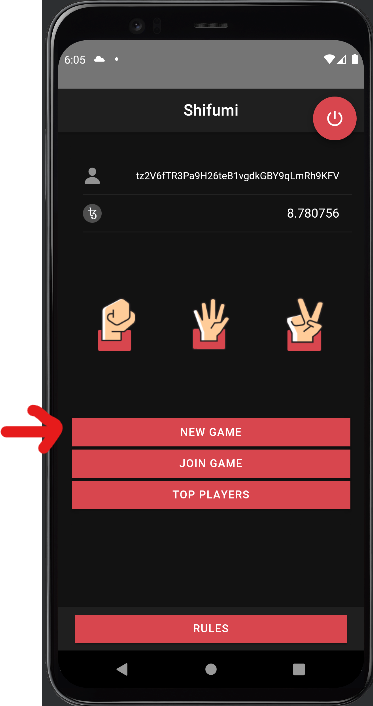
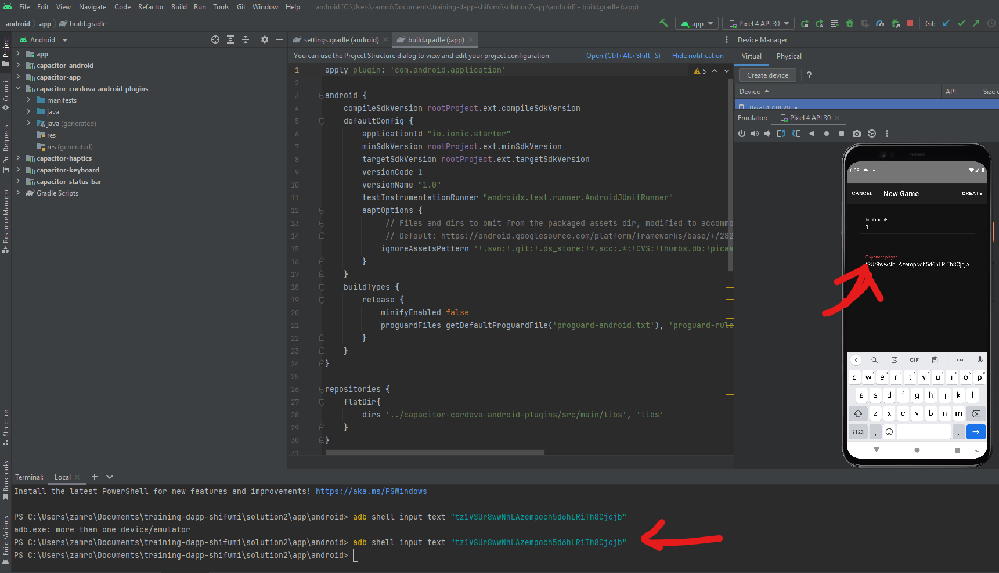
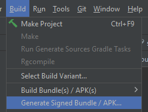

## :round_pushpin: [See Github version and full code here](https://github.com/marigold-dev/training-dapp-shifumi)

# Training Shifumi (:iphone: version)

# :fist: :hand: :v: Shifumi :mount_fuji: :page_facing_up: :scissors:



Rock paper scissors (also known by other orderings of the three items, with "rock" sometimes being called "stone," or as Rochambeau, roshambo, or ro-sham-bo) is a hand game originating from China, usually played between two people, in which each player simultaneously forms one of three shapes with an outstretched hand.

These shapes are "rock" (a closed fist), "paper" (a flat hand), and "scissors" (a fist with the index finger and middle finger extended, forming a V). "Scissors" is identical to the two-fingered V sign (also indicating "victory" or "peace") except that it is pointed horizontally instead of being held upright in the air.

[Wikipedia link](https://en.wikipedia.org/wiki/Rock_paper_scissors)

# :memo: Prerequisites

Please install this software first on your machine or use online alternative :

- [ ] [VS Code](https://code.visualstudio.com/download) : as text editor
- [ ] [npm](https://nodejs.org/en/download/) : we will use a typescript React client app
- [ ] [yarn](https://classic.yarnpkg.com/lang/en/docs/install/#windows-stable) : because yet another package manager (https://www.geeksforgeeks.org/difference-between-npm-and-yarn/)
- [ ] [taqueria v0.37.0](https://github.com/ecadlabs/taqueria) : Tezos Dapp project tooling
- [ ] [taqueria VS Code extension](https://marketplace.visualstudio.com/items?itemName=ecadlabs.taqueria-vscode) : visualize your project and execute tasks
- [ ] [ligo VS Code extension](https://marketplace.visualstudio.com/items?itemName=ligolang-publish.ligo-vscode) : for smart contract highlighting, completion, etc ..
- [ ] [Temple wallet](https://templewallet.com/) : an easy to use Tezos wallet in your browser (but any other should work, as we will see Kukai is a good option for the Android emulator)
- [ ] [Docker](https://docs.docker.com/engine/install/) you cannot do anything without containers today ...

> :warning: :whale: About Taqueria : taqueria is using software images from Docker to run Ligo, etc ... Docker should be running on your machine :whale2:

# :scroll: Smart contract

## Step 1 : Create folder & file

> Note : We will use CLI here but you can also use GUI from the IDE or Taqueria plugin

```bash
taq init shifumi
cd shifumi
taq install @taqueria/plugin-ligo
```

> :warning: HACK note : create a dummy esy.json file with `{}` content on it. I will be used by the ligo package installer to not override the default package.json file of taqueria

```bash
echo "{}" > esy.json
```

Clone the ligo template locally, we will take only the source for our training

```bash
TAQ_LIGO_IMAGE=ligolang/ligo:0.70.1 taq ligo --command "init contract --template shifumi-jsligo shifumiTemplate"
cp -r shifumiTemplate/src/* contracts/
```

## Step 2 : Add initial storage and compile

Compile the contract once, in order to create the default required file `main.storageList.jsligo` used at deployment step later

```bash
TAQ_LIGO_IMAGE=ligolang/ligo:0.70.1 taq compile main.jsligo
```

Edit `main.storageList.jsligo`

```jsligo
#include "main.jsligo"

const default_storage = {
    metadata: Big_map.literal(list([["",bytes `tezos-storage:contents`],
    ["contents", bytes `
    {
    "name": "Shifumi Example",
    "description": "An Example Shifumi Contract",
    "version": "beta",
    "license": {
        "name": "MIT"
    },
    "authors": [
        "smart-chain <tezos@smart-chain.fr>"
    ],
    "homepage": "https://github.com/ligolang/shifumi-jsligo",
    "source": {
        "tools": "jsligo",
        "location": "https://github.com/ligolang/shifumi-jsligo/contracts"
    },
    "interfaces": [
        "TZIP-016"
    ]
    }
    `]
    ]))   as big_map<string, bytes>,
    next_session: 0 as nat,
    sessions: Map.empty as  map<nat, Session.t>,
  }
```

Compile again

```bash
TAQ_LIGO_IMAGE=ligolang/ligo:0.70.1 taq compile main.jsligo
```

## Step 3 : Deploy to Ghostnet

```bash
taq install @taqueria/plugin-taquito
taq deploy main.tz -e "testing"
```

> Note : if it is the first time you use taqueria, I recommend to look at this training first [https://github.com/marigold-dev/training-dapp-1#ghostnet-testnet-wallet](https://github.com/marigold-dev/training-dapp-1#ghostnet-testnet-wallet)
> For advanced users, just go to `.taq/config.local.testing.json` and change the default account on path `/accounts` to alice settings (publicKey,publicKeyHash,privateKey) and then redeploy
>
> ```json
> "accounts": {
>                "taqOperatorAccount": {
>                    "publicKey": "edpkvGfYw3LyB1UcCahKQk4rF2tvbMUk8GFiTuMjL75uGXrpvKXhjn",
>                    "publicKeyHash": "tz1VSUr8wwNhLAzempoch5d6hLRiTh8Cjcjb",
>                    "privateKey": "edsk3QoqBuvdamxouPhin7swCvkQNgq4jP5KZPbwWNnwdZpSpJiEbq"
>                }
>            }
> ```

HOORAY :confetti_ball: your smart contract is ready on the Ghostnet !

```logs
┌──────────┬──────────────────────────────────────┬───────┬──────────────────┬────────────────────────────────┐
│ Contract │ Address                              │ Alias │ Balance In Mutez │ Destination                    │
├──────────┼──────────────────────────────────────┼───────┼──────────────────┼────────────────────────────────┤
│ main.tz  │ KT1UhUfUkNbPiH1TPuumNQwdUXEee27grhZ3 │ main  │ 0                │ https://ghostnet.ecadinfra.com │
└──────────┴──────────────────────────────────────┴───────┴──────────────────┴────────────────────────────────┘
```

# Mobile app

We will use Ionic React to be able to reuse the [BeaconSDK](https://github.com/airgap-it/beacon-sdk) (Typescript) on a webview. Beacon is the protocol of communication between the dapp and the wallet.

> Note : I do not recommend right know to develop a dapp in Flutter or React Native because you will need to use native beacon library without wallet popup mechanism to confirm transactions

## Step 1 : Install IONIC

Install [Ionic](https://ionicframework.com/docs/react)

```
npm install -g @ionic/cli
ionic start app blank --type react
```

Generate Smart contract types from taqueria plugin. It will generate Typescript classes from Smart contract interface definition that we will use on our frontend.

```bash
taq install @taqueria/plugin-contract-types
taq generate types ./app/src
```

> Fix bug taqueria v0.37
> Edit main.code.ts to change board field definition

```js
  board: MMap<nat, { Some: address } | null>;
```

Uninstall confliting old jest libraries/react-scripts and Install required Tezos web3 dependencies + vite

```
cd app
npm uninstall -S react-scripts
npm uninstall -S @testing-library/jest-dom @testing-library/react @testing-library/user-event @types/jest
rm -rf src/components
rm src/setupTests.ts src/react-app-env.d.ts src/reportWebVitals.ts src/serviceWorkerRegistration.ts src/App.test.tsx
echo '/// <reference types="vite/client" />' > src/vite-env.d.ts
sed -i 's/process.env.PUBLIC_URL/import.meta.env.VITE_PUBLIC_URL/' src/service-worker.ts

npm install -S typescript@^5.1.6 @taquito/taquito @taquito/beacon-wallet @airgap/beacon-sdk  @dipdup/tzkt-api
npm install -S -D @airgap/beacon-types vite @vitejs/plugin-react-swc @types/react @types/node
```

### Polyfill issues fix

> :warning: :warning: :warning: Before we start we need to add the following dependencies in order to not get polyfill issues. The reason for this step is that certain required dependencies are Node APIs, thus not included in Browsers. But still needed for communication and interaction with Wallets and Smart Contracts.

For example, in my case, I installed this :

```bash
npm i -D process buffer crypto-browserify stream-browserify assert stream-http https-browserify os-browserify url path-browserify
```

then create a new file `nodeSpecific.ts` in the src folder of your project

```bash
touch src/nodeSpecific.ts
```

and edit with this content :

```js
import { Buffer } from "buffer";

globalThis.Buffer = Buffer;
```

Finally create the `vite.config.ts` file

```bash
touch vite.config.ts
```

and edit it with this content :

```js
import { defineConfig } from "vite";
import react from "@vitejs/plugin-react-swc";

// https://vitejs.dev/config/
export default defineConfig({
  define: {
    "process.env": process.env,
    global: {},
  },
  build: {
    commonjsOptions: {
      transformMixedEsModules: true,
    },
  },
  plugins: [react()],
  resolve: {
    alias: {
      stream: "stream-browserify",
      os: "os-browserify/browser",
      util: "util",
      process: "process/browser",
      buffer: "buffer",
      crypto: "crypto-browserify",
      assert: "assert",
      http: "stream-http",
      https: "https-browserify",
      url: "url",
      path: "path-browserify",
    },
  },
});
```

### Adaptation for Vite

Move the `index.html` file from public folder to the root

```bash
mv public/index.html .
```

and edit to add the following scripts in the body and change favicon. It should look like this :

```html
<!DOCTYPE html>
<html lang="en">
  <head>
    <meta charset="utf-8" />
    <title>Ionic App</title>

    <base href="/" />

    <meta name="color-scheme" content="light dark" />
    <meta
      name="viewport"
      content="viewport-fit=cover, width=device-width, initial-scale=1.0, minimum-scale=1.0, maximum-scale=1.0, user-scalable=no"
    />
    <meta name="format-detection" content="telephone=no" />
    <meta name="msapplication-tap-highlight" content="no" />

    <link rel="shortcut icon" type="image/webp" href="favicon.webp" />
    <link href="assets/styles.css" rel="stylesheet" />

    <!-- add to homescreen for ios -->
    <meta name="apple-mobile-web-app-capable" content="yes" />
    <meta name="apple-mobile-web-app-title" content="Ionic App" />
    <meta name="apple-mobile-web-app-status-bar-style" content="black" />
  </head>

  <body>
    <div id="root"></div>
    <script type="module" src="/src/nodeSpecific.ts"></script>
    <script type="module" src="/src/index.tsx"></script>
  </body>
</html>
```

Edit `src/index.tsx`` as it :

```typescript
import { createRoot } from "react-dom/client";
import App from "./App";

const container = document.getElementById("root");
const root = createRoot(container!);

// Add or remove the "dark" class based on if the media query matches
document.body.classList.add("dark");

root.render(<App />);
```

Modify the default `package.json` default scripts to use vite instead of default react scripts

```json
  "scripts": {
    "dev": "jq -r '\"VITE_CONTRACT_ADDRESS=\" + last(.tasks[]).output[0].address' ../.taq/testing-state.json > .env && vite --host",
    "ionic:build": "tsc -v && tsc && vite build",
    "build": " tsc -v && tsc && vite build",
    "lint": "eslint src --ext ts,tsx --report-unused-disable-directives --max-warnings 0",
    "preview": "vite preview",
    "ionic:serve": "vite dev --host",
    "sync": "npm run build && ionic cap sync --no-build"
  },
```

Run web version as it is easier to develop/test/debug first

```bash
npm run dev
```

## Step 2 : Edit the default Application file to configure page routing and add the style

Edit `src/App.tsx` main file

```typescript
import {
  IonApp,
  IonRouterOutlet,
  RefresherEventDetail,
  setupIonicReact,
} from "@ionic/react";
import { IonReactRouter } from "@ionic/react-router";
import { Redirect, Route } from "react-router-dom";

/* Core CSS required for Ionic components to work properly */
import "@ionic/react/css/core.css";

/* Basic CSS for apps built with Ionic */
import "@ionic/react/css/normalize.css";
import "@ionic/react/css/structure.css";
import "@ionic/react/css/typography.css";

/* Optional CSS utils that can be commented out */
import "@ionic/react/css/display.css";
import "@ionic/react/css/flex-utils.css";
import "@ionic/react/css/float-elements.css";
import "@ionic/react/css/padding.css";
import "@ionic/react/css/text-alignment.css";
import "@ionic/react/css/text-transformation.css";

/* Theme variables */
import "./theme/variables.css";

import { NetworkType } from "@airgap/beacon-types";
import { BeaconWallet } from "@taquito/beacon-wallet";
import { PollingSubscribeProvider, TezosToolkit } from "@taquito/taquito";
import React, { Dispatch, SetStateAction, useEffect, useState } from "react";
import { MainWalletType, Storage } from "./main.types";
import { HomeScreen } from "./pages/HomeScreen";
import { RulesScreen } from "./pages/Rules";
import { SessionScreen } from "./pages/SessionScreen";
import { TopPlayersScreen } from "./pages/TopPlayersScreen";
import { MMap, address, bytes, nat, timestamp, unit } from "./type-aliases";

setupIonicReact();

export class Action implements ActionCisor, ActionPaper, ActionStone {
  cisor?: unit;
  paper?: unit;
  stone?: unit;
  constructor(cisor?: unit, paper?: unit, stone?: unit) {
    this.cisor = cisor;
    this.paper = paper;
    this.stone = stone;
  }
}
export type ActionCisor = { cisor?: unit };
export type ActionPaper = { paper?: unit };
export type ActionStone = { stone?: unit };

export type Session = {
  asleep: timestamp;
  board: MMap<nat, address>;
  current_round: nat;
  decoded_rounds: MMap<
    nat,
    Array<{
      action: { cisor: unit } | { paper: unit } | { stone: unit };
      player: address;
    }>
  >;
  players: Array<address>;
  result: { draw: unit } | { inplay: unit } | { winner: address };
  rounds: MMap<
    nat,
    Array<{
      action: bytes;
      player: address;
    }>
  >;
  total_rounds: nat;
};

export type UserContextType = {
  storage: Storage | null;
  setStorage: Dispatch<SetStateAction<Storage | null>>;
  userAddress: string;
  setUserAddress: Dispatch<SetStateAction<string>>;
  userBalance: number;
  setUserBalance: Dispatch<SetStateAction<number>>;
  Tezos: TezosToolkit;
  wallet: BeaconWallet;
  mainWalletType: MainWalletType | null;
  loading: boolean;
  setLoading: Dispatch<SetStateAction<boolean>>;
  refreshStorage: (event?: CustomEvent<RefresherEventDetail>) => Promise<void>;
};
export const UserContext = React.createContext<UserContextType | null>(null);

const App: React.FC = () => {
  const Tezos = new TezosToolkit("https://ghostnet.tezos.marigold.dev");

  const wallet = new BeaconWallet({
    name: "Training",
    preferredNetwork: NetworkType.GHOSTNET,
  });

  Tezos.setWalletProvider(wallet);

  const [userAddress, setUserAddress] = useState<string>("");
  const [userBalance, setUserBalance] = useState<number>(0);
  const [storage, setStorage] = useState<Storage | null>(null);
  const [mainWalletType, setMainWalletType] = useState<MainWalletType | null>(
    null
  );
  const [loading, setLoading] = useState<boolean>(false);

  const refreshStorage = async (
    event?: CustomEvent<RefresherEventDetail>
  ): Promise<void> => {
    if (wallet) {
      const activeAccount = await wallet.client.getActiveAccount();
      let userAddress: string;
      if (activeAccount) {
        userAddress = activeAccount.address;
        setUserAddress(userAddress);
        const balance = await Tezos.tz.getBalance(userAddress);
        setUserBalance(balance.toNumber());
      }

      console.log(
        "REACT_APP_CONTRACT_ADDRESS:",
        import.meta.env.VITE_CONTRACT_ADDRESS
      );
      const mainWalletType: MainWalletType =
        await Tezos.wallet.at<MainWalletType>(
          import.meta.env.VITE_CONTRACT_ADDRESS
        );
      const storage: Storage = await mainWalletType.storage();
      setMainWalletType(mainWalletType);
      setStorage(storage);
      console.log("Storage refreshed");
    } else {
      console.log("Not yet a wallet");
    }
    event?.detail.complete();
  };

  useEffect(() => {
    if (userAddress) {
      console.warn("userAddress changed", wallet);
      Tezos.setStreamProvider(
        Tezos.getFactory(PollingSubscribeProvider)({
          shouldObservableSubscriptionRetry: true,
          pollingIntervalMilliseconds: 1500,
        })
      );
      try {
        const sub = Tezos.stream.subscribeEvent({
          tag: "gameStatus",
          address: import.meta.env.VITE_CONTRACT_ADDRESS!,
        });

        sub.on("data", (e) => {
          console.log("on gameStatus event :", e);
          refreshStorage();
        });
      } catch (e) {
        console.log("Error with Smart contract event pooling", e);
      }
      (async () => await refreshStorage())();
    }
  }, [userAddress]);

  return (
    <IonApp>
      <UserContext.Provider
        value={{
          userAddress,
          userBalance,
          Tezos,
          wallet,
          storage,
          mainWalletType,
          setUserAddress,
          setUserBalance,
          setStorage,
          loading,
          setLoading,
          refreshStorage,
        }}
      >
        <IonReactRouter>
          <IonRouterOutlet>
            <Route path={PAGES.HOME} component={HomeScreen} />
            <Route path={`${PAGES.SESSION}/:id`} component={SessionScreen} />
            <Route path={PAGES.TOPPLAYERS} component={TopPlayersScreen} />
            <Route path={PAGES.RULES} component={RulesScreen} />
            <Redirect exact from="/" to={PAGES.HOME} />
          </IonRouterOutlet>
        </IonReactRouter>
      </UserContext.Provider>
    </IonApp>
  );
};

export enum PAGES {
  HOME = "/home",
  SESSION = "/session",
  TOPPLAYERS = "/topplayers",
  RULES = "/rules",
}

export default App;
```

Explanations :

- `import "@ionic..."` : Default standard Ionic imports
- `import ... from "@airgap/beacon-types" ... from "@taquito/beacon-wallet" ... from "@taquito/taquito"` : Require libraries to interact with the Tezos node and the wallet
- `export class Action implements ActionCisor, ActionPaper, ActionStone {...}` : Representation of the ligo variant `Action` in Typescript, we will need it when passing arguments on `Play` function
- `export type Session = {...}` : Taqueria export the global Storage type but sadly not this sub-type from the Storage type, we will need it later, so we extract a copy
- `export const UserContext = React.createContext<UserContextType | null>(null)`: Global React context that is passed along pages. More info on React context [here](https://beta.reactjs.org/learn/passing-data-deeply-with-context)
- `const refreshStorage = async (event?: CustomEvent<RefresherEventDetail>): Promise<void> => {...` : useful fonction to force the smart contract Storage to refresh on React state changes (user balance, state of the game)
- `useEffect(() => { ... Tezos.setStreamProvider(...) ... Tezos.stream.subscribeEvent({...` : During Application initialization, we configure the wallet, the websocket listening to smart contract events
- `<IonApp><UserContext.Provider ... ><IonReactRouter><IonRouterOutlet><Route path={PAGES.HOME} component={HomeScreen} /> ... ` : We inject the React context to all pages. We declare the global routing of the application
- `export enum PAGES {  HOME = "/home", ...` : Declaration of the global routes

To add the default theming (CSS, pictures, etc...), copy the content of this git repository named `assets` folder to your local project (considering you cloned the repo and assets folder is on root folder and your project folder is called `shifumi`)

```bash
cp -r ./assets/* ./shifumi/app/
```

## Step 3 : Connect / disconnect the wallet

We will declare 2 React Button components and fetch the user public hash key + balance

Let's create the 2 missing src component files and put code in it.
On `app` folder, create these files.

```bash
touch src/ConnectWallet.tsx
touch src/DisconnectWallet.tsx
```

ConnectWallet button will create an instance wallet, get user permissions via a popup and then retrieve account information

Edit `ConnectWallet.tsx`

```typescript
import { NetworkType } from "@airgap/beacon-types";
import { IonButton } from "@ionic/react";
import { BeaconWallet } from "@taquito/beacon-wallet";
import { TezosToolkit } from "@taquito/taquito";
import { Dispatch, SetStateAction } from "react";

type ButtonProps = {
  Tezos: TezosToolkit;
  setUserAddress: Dispatch<SetStateAction<string>>;
  setUserBalance: Dispatch<SetStateAction<number>>;
  wallet: BeaconWallet;
};

const ConnectButton = ({
  Tezos,
  setUserAddress,
  setUserBalance,
  wallet,
}: ButtonProps): JSX.Element => {
  const connectWallet = async (): Promise<void> => {
    try {
      console.log("before requestPermissions");

      await wallet.requestPermissions({
        network: {
          type: NetworkType.GHOSTNET,
          rpcUrl: "https://ghostnet.tezos.marigold.dev",
        },
      });
      console.log("after requestPermissions");

      // gets user's address
      const userAddress = await wallet.getPKH();
      const balance = await Tezos.tz.getBalance(userAddress);
      setUserBalance(balance.toNumber());
      setUserAddress(userAddress);
    } catch (error) {
      console.log("error connectWallet", error);
    }
  };

  return (
    <IonButton expand="full" onClick={connectWallet}>
      Connect Wallet
    </IonButton>
  );
};

export default ConnectButton;
```

DisconnectWallet button will clean wallet instance and all linked objects

```typescript
import { IonFab, IonFabButton, IonIcon } from "@ionic/react";
import { BeaconWallet } from "@taquito/beacon-wallet";
import { power } from "ionicons/icons";
import { Dispatch, SetStateAction } from "react";

interface ButtonProps {
  wallet: BeaconWallet;
  setUserAddress: Dispatch<SetStateAction<string>>;
  setUserBalance: Dispatch<SetStateAction<number>>;
}

const DisconnectButton = ({
  wallet,
  setUserAddress,
  setUserBalance,
}: ButtonProps): JSX.Element => {
  const disconnectWallet = async (): Promise<void> => {
    setUserAddress("");
    setUserBalance(0);
    console.log("disconnecting wallet");
    await wallet.clearActiveAccount();
  };

  return (
    <IonFab slot="fixed" vertical="top" horizontal="end">
      <IonFabButton>
        <IonIcon icon={power} onClick={disconnectWallet} />
      </IonFabButton>
    </IonFab>
  );
};

export default DisconnectButton;
```

Save both file, the dev server should refresh the page

## Step 4 : Add missing pages and error utility class

Let's create the missing pages and the error utility class

```bash
touch src/pages/HomeScreen.tsx
touch src/pages/SessionScreen.tsx
touch src/pages/Rules.tsx
touch src/pages/TopPlayersScreen.tsx
touch src/TransactionInvalidBeaconError.ts
```

`TransactionInvalidBeaconError.ts` utility class is used to display human readable message from Beacon errors

Edit all files

- HomeScreen.tsx : the home page where you can access all other pages

```typescript
import {
  IonButton,
  IonButtons,
  IonContent,
  IonFooter,
  IonHeader,
  IonIcon,
  IonImg,
  IonInput,
  IonItem,
  IonLabel,
  IonList,
  IonModal,
  IonPage,
  IonRefresher,
  IonRefresherContent,
  IonSpinner,
  IonTitle,
  IonToolbar,
  useIonAlert,
} from "@ionic/react";
import { BigNumber } from "bignumber.js";
import { person } from "ionicons/icons";
import React, { useEffect, useRef, useState } from "react";
import { useHistory } from "react-router-dom";
import { PAGES, Session, UserContext, UserContextType } from "../App";
import ConnectButton from "../ConnectWallet";
import DisconnectButton from "../DisconnectWallet";
import { TransactionInvalidBeaconError } from "../TransactionInvalidBeaconError";
import Paper from "../assets/paper-logo.webp";
import Scissor from "../assets/scissor-logo.webp";
import Stone from "../assets/stone-logo.webp";
import XTZLogo from "../assets/xtz.webp";
import { address, nat } from "../type-aliases";

export const HomeScreen: React.FC = () => {
  const [presentAlert] = useIonAlert();
  const { push } = useHistory();

  const createGameModal = useRef<HTMLIonModalElement>(null);
  const selectGameModal = useRef<HTMLIonModalElement>(null);
  function dismissCreateGameModal() {
    console.log("dismissCreateGameModal");
    createGameModal.current?.dismiss();
  }
  function dismissSelectGameModal() {
    selectGameModal.current?.dismiss();
    const element = document.getElementById("home");
    setTimeout(() => {
      return element && element.remove();
    }, 1000); // Give a little time to properly unmount your previous page before removing the old one
  }

  const {
    Tezos,
    wallet,
    userAddress,
    userBalance,
    storage,
    mainWalletType,
    setStorage,
    setUserAddress,
    setUserBalance,
    setLoading,
    loading,
    refreshStorage,
  } = React.useContext(UserContext) as UserContextType;

  const [newPlayer, setNewPlayer] = useState<address>("" as address);
  const [total_rounds, setTotal_rounds] = useState<nat>(
    new BigNumber(1) as nat
  );
  const [myGames, setMyGames] = useState<Map<nat, Session>>();

  useEffect(() => {
    (async () => {
      if (storage) {
        const myGames = new Map(); //filtering our games
        Array.from(storage.sessions.keys()).forEach((key) => {
          const session = storage.sessions.get(key);

          if (
            session.players.indexOf(userAddress as address) >= 0 &&
            "inplay" in session.result
          ) {
            myGames.set(key, session);
          }
        });
        setMyGames(myGames);
      } else {
        console.log("storage is not ready yet");
      }
    })();
  }, [storage]);

  const createSession = async (
    e: React.MouseEvent<HTMLIonButtonElement, MouseEvent>
  ) => {
    console.log("createSession");
    e.preventDefault();
    dismissCreateGameModal();

    try {
      setLoading(true);
      const op = await mainWalletType?.methods
        .createSession([userAddress as address, newPlayer], total_rounds)
        .send();
      await op?.confirmation();
      const newStorage = await mainWalletType?.storage();
      setStorage(newStorage!);
      setLoading(false);
      push(PAGES.SESSION + "/" + storage?.next_session.toString()); //it was the id created
      dismissCreateGameModal();
      console.log("newStorage", newStorage);
    } catch (error) {
      console.table(`Error: ${JSON.stringify(error, null, 2)}`);
      const tibe: TransactionInvalidBeaconError =
        new TransactionInvalidBeaconError(error);
      presentAlert({
        header: "Error",
        message: tibe.data_message,
        buttons: ["Close"],
      });
      setLoading(false);
    }
    setLoading(false);
  };

  return (
    <IonPage className="container">
      <IonHeader>
        <IonToolbar>
          <IonTitle>Shifumi</IonTitle>
        </IonToolbar>
      </IonHeader>
      <IonContent fullscreen>
        <IonRefresher slot="fixed" onIonRefresh={refreshStorage}>
          <IonRefresherContent></IonRefresherContent>
        </IonRefresher>

        {loading ? (
          <div className="loading">
            <IonItem>
              <IonLabel>Refreshing ...</IonLabel>
              <IonSpinner className="spinner"></IonSpinner>
            </IonItem>
          </div>
        ) : (
          <IonList inset={true}>
            {!userAddress ? (
              <>
                <div
                  style={{
                    display: "flex",
                    flexDirection: "row",
                    padding: "4em",
                    justifyContent: "space-around",
                  }}
                >
                  <IonImg src={Stone} className="logo" />
                  <IonImg src={Paper} className="logo" />
                  <IonImg src={Scissor} className="logo" />
                </div>
                <IonList inset={true}>
                  <ConnectButton
                    Tezos={Tezos}
                    setUserAddress={setUserAddress}
                    setUserBalance={setUserBalance}
                    wallet={wallet}
                  />
                </IonList>
              </>
            ) : (
              <IonList>
                <IonItem style={{ padding: 0, margin: 0 }}>
                  <IonIcon icon={person} />
                  <IonLabel style={{ fontSize: "0.8em", direction: "rtl" }}>
                    {userAddress}
                  </IonLabel>
                </IonItem>
                <IonItem style={{ padding: 0, margin: 0 }}>
                  <IonImg style={{ height: 24, width: 24 }} src={XTZLogo} />
                  <IonLabel style={{ direction: "rtl" }}>
                    {userBalance / 1000000}
                  </IonLabel>
                </IonItem>

                <div
                  style={{
                    display: "flex",
                    flexDirection: "row",
                    paddingTop: "10vh",
                    paddingBottom: "10vh",
                    justifyContent: "space-around",
                    width: "100%",
                  }}
                >
                  <IonImg src={Stone} className="logo" />
                  <IonImg src={Paper} className="logo" />
                  <IonImg src={Scissor} className="logo" />
                </div>

                <IonButton id="createGameModalVisible" expand="full">
                  New game
                </IonButton>
                <IonModal
                  ref={createGameModal}
                  trigger="createGameModalVisible"
                >
                  <IonHeader>
                    <IonToolbar>
                      <IonButtons slot="start">
                        <IonButton onClick={() => dismissCreateGameModal()}>
                          Cancel
                        </IonButton>
                      </IonButtons>
                      <IonTitle>New Game</IonTitle>
                      <IonButtons slot="end">
                        <IonButton
                          strong={true}
                          onClick={(e) => createSession(e)}
                          id="createGameModal"
                        >
                          Create
                        </IonButton>
                      </IonButtons>
                    </IonToolbar>
                  </IonHeader>
                  <IonContent>
                    <IonItem key="total_rounds">
                      <IonLabel position="stacked" className="text">
                        total rounds
                      </IonLabel>
                      <IonInput
                        onIonChange={(str: any) => {
                          if (str.detail.value === undefined) return;
                          setTotal_rounds(
                            new BigNumber(str.target.value) as nat
                          );
                        }}
                        value={total_rounds.toString()}
                        placeholder="total_rounds"
                        type="number"
                        label="Total Rounds"
                      />
                    </IonItem>
                    <IonItem key="newPlayer">
                      <IonLabel position="stacked" className="text">
                        Opponent player
                      </IonLabel>
                      <IonInput
                        onIonChange={(str: any) => {
                          if (str.detail.value === undefined) return;
                          setNewPlayer(str.detail.value as address);
                        }}
                        value={newPlayer}
                        placeholder="tz1..."
                        type="text"
                        label="Tezos Address"
                      />
                    </IonItem>
                  </IonContent>
                </IonModal>

                <IonButton id="selectGameModalVisible" expand="full">
                  Join game
                </IonButton>
                <IonModal
                  ref={selectGameModal}
                  trigger="selectGameModalVisible"
                >
                  <IonHeader>
                    <IonToolbar>
                      <IonButtons slot="start">
                        <IonButton onClick={() => dismissSelectGameModal()}>
                          Cancel
                        </IonButton>
                      </IonButtons>
                      <IonTitle>Select Game</IonTitle>
                    </IonToolbar>
                  </IonHeader>
                  <IonContent>
                    <IonList inset={true}>
                      {myGames
                        ? Array.from(myGames.entries()).map(([key, _]) => (
                            <IonButton
                              key={"Game-" + key.toString()}
                              expand="full"
                              routerLink={PAGES.SESSION + "/" + key.toString()}
                              onClick={dismissSelectGameModal}
                            >
                              {"Game n°" + key.toString()}
                            </IonButton>
                          ))
                        : []}
                    </IonList>
                  </IonContent>
                </IonModal>

                <IonButton routerLink={PAGES.TOPPLAYERS} expand="full">
                  Top Players
                </IonButton>
              </IonList>
            )}
          </IonList>
        )}
      </IonContent>
      <IonFooter>
        <IonToolbar>
          <IonTitle>
            <IonButton color="primary" routerLink={PAGES.RULES} expand="full">
              Rules
            </IonButton>
          </IonTitle>
        </IonToolbar>
      </IonFooter>

      {userAddress ? (
        <DisconnectButton
          wallet={wallet}
          setUserAddress={setUserAddress}
          setUserBalance={setUserBalance}
        />
      ) : (
        <></>
      )}
    </IonPage>
  );
};
```

Explanation :

- `const createGameModal` : The popup to create a new game
- `const selectGameModal` : The popup to select a game to join
- `const [newPlayer, setNewPlayer] = useState<address>("" as address)` : Used on `New Game` popup form to add an opponent
- `const [total_rounds, setTotal_rounds] = useState<nat>(new BigNumber(1) as nat)` : Used on `New Game` popup form to set number of round for one game
- `const [myGames, setMyGames] = useState<Map<nat, Session>>()` : Used on `Join Game` popup window to display the games we have created or we are invited to
- `Array.from(storage.sessions.keys()).forEach((key) => { ... if (session.players.indexOf(userAddress as address) >= 0 && "inplay" in session.result ...` : On storage change event, we fetch and filter only games we can join and play (i.e with `inplay` status and where user appears on player list)
- `const createSession = async (...) => { ...  const op = await mainWalletType!.methods.createSession([userAddress as address, newPlayer], total_rounds).send(); ... ` : createSession function will call the Smart contract entrypoint passing on arguments : current user address,opponent address and total rounds, then it will redirect to the newly created game page
- `{...<IonButton ... routerLink={PAGES.SESSION + "/" + key.toString()}` : If you click on a game button from the list it will redirect you to the game to play

- SessionScreen.tsx : it is the game page where you can play on limited rounds and where the result of the game will be displayed at the end

```typescript
import { IonPage } from "@ionic/react";
import React from "react";

export const SessionScreen: React.FC = () => {
  return <IonPage className="container"></IonPage>;
};
```

We leave it empty for now and we will edit it later and explain what to write

- TopPlayersScreen.tsx : it is the player ranking page

```typescript
import { IonPage } from "@ionic/react";
import React from "react";

export const TopPlayersScreen: React.FC = () => {
  return <IonPage className="container"></IonPage>;
};
```

We leave it empty for now and edit it later too

- Rules.tsx : just some information about game rules

```typescript
import {
  IonButton,
  IonButtons,
  IonContent,
  IonHeader,
  IonImg,
  IonItem,
  IonList,
  IonPage,
  IonTitle,
  IonToolbar,
} from "@ionic/react";
import React from "react";
import { useHistory } from "react-router-dom";
import Clock from "../assets/clock.webp";
import Legend from "../assets/legend.webp";
import Paper from "../assets/paper-logo.webp";
import Scissor from "../assets/scissor-logo.webp";
import Stone from "../assets/stone-logo.webp";

export const RulesScreen: React.FC = () => {
  const { back } = useHistory();

  /* 2. Get the param */
  return (
    <IonPage className="container">
      <IonHeader>
        <IonToolbar>
          <IonButtons slot="start">
            <IonButton onClick={back}>Back</IonButton>
          </IonButtons>
          <IonTitle>Rules</IonTitle>
        </IonToolbar>
      </IonHeader>
      <IonContent fullscreen>
        <div style={{ textAlign: "left" }}>
          <IonList>
            <IonItem className="nopm">
              <IonImg src={Stone} className="logo" />
              Stone (Clenched Fist). Rock beats the scissors by hitting it
            </IonItem>
            <IonItem className="nopm">
              <IonImg src={Paper} className="logo" />
              Paper (open and extended hand) . Paper wins over stone by enveloping
              it
            </IonItem>
            <IonItem className="nopm">
              <IonImg src={Scissor} className="logo" />
              Scissors (closed hand with the two fingers) . Scissors wins paper cutting
              it
            </IonItem>

            <IonItem className="nopm">
              <IonImg src={Clock} className="logo" />
              If you are inactive for more than 10 minutes your opponent can claim
              the victory
            </IonItem>

            <IonItem className="nopm">
              <IonImg src={Legend} className="logo" />
              <ul style={{ listStyle: "none" }}>
                <li className="win">Won round</li>
                <li className="lose">Lost round</li>
                <li className="draw">Draw</li>
                <li className="current">Current Round</li>
                <li className="missing">Missing Rounds</li>
              </ul>
            </IonItem>
          </IonList>
        </div>
      </IonContent>
    </IonPage>
  );
};
```

- TransactionInvalidBeaconError.ts the utility class that formats Beacon errors

```typescript
export class TransactionInvalidBeaconError {
  name: string;
  title: string;
  message: string;
  description: string;
  data_contract_handle: string;
  data_expected_form: string;
  data_message: string;

  /**
      * 
      * @param transactionInvalidBeaconError  {
      "name": "UnknownBeaconError",
      "title": "Aborted",
      "message": "[ABORTED_ERROR]:The action was aborted by the user.",
      "description": "The action was aborted by the user."
  }
  */

  constructor(transactionInvalidBeaconError: any) {
    this.name = transactionInvalidBeaconError.name;
    this.title = transactionInvalidBeaconError.title;
    this.message = transactionInvalidBeaconError.message;
    this.description = transactionInvalidBeaconError.description;
    this.data_contract_handle = "";
    this.data_expected_form = "";
    this.data_message = this.message;
    if (transactionInvalidBeaconError.data !== undefined) {
      let dataArray = Array.from<any>(
        new Map(
          Object.entries<any>(transactionInvalidBeaconError.data)
        ).values()
      );
      let contract_handle = dataArray.find(
        (obj) => obj.contract_handle !== undefined
      );
      this.data_contract_handle =
        contract_handle !== undefined ? contract_handle.contract_handle : "";
      let expected_form = dataArray.find(
        (obj) => obj.expected_form !== undefined
      );
      this.data_expected_form =
        expected_form !== undefined
          ? expected_form.expected_form +
            ":" +
            expected_form.wrong_expression.string
          : "";
      this.data_message =
        (this.data_contract_handle
          ? "Error on contract : " + this.data_contract_handle + " "
          : "") +
        (this.data_expected_form
          ? "error : " + this.data_expected_form + " "
          : "");
    }
  }
}
```

## Step 4 : Test it

To test in web

```bash
npm run dev
```

We consider that you wallet is well configured and has some XTZ on Ghostnet, so click on Connect button
(Note : If you don't have tokens, to get some free XTZ on Ghostnet, follow this link to the [faucet](https://faucet.marigold.dev/))

On the popup, select your Wallet, then your account and connect.

:confetti_ball: You are "logged"

Click on the Disconnect button to logout

## Step 5 : Play on a game session

Click on `New Game` button from Home page and then create a new game
Confirm the operation with your wallet

You are redirected the new game session page (that is blank page right now)

Edit the file `./src/SessionScreen.tsx`

```typescript
import {
  IonButton,
  IonButtons,
  IonContent,
  IonFooter,
  IonHeader,
  IonIcon,
  IonImg,
  IonItem,
  IonLabel,
  IonList,
  IonPage,
  IonRefresher,
  IonRefresherContent,
  IonSpinner,
  IonTitle,
  IonToolbar,
  useIonAlert,
} from "@ionic/react";
import { PackDataParams } from "@taquito/rpc";
import { MichelCodecPacker } from "@taquito/taquito";
import { BigNumber } from "bignumber.js";
import * as crypto from "crypto";
import { eye, stopCircle } from "ionicons/icons";
import React, { useEffect, useState } from "react";
import { RouteComponentProps, useHistory } from "react-router-dom";
import { Action, PAGES, UserContext, UserContextType } from "../App";
import { TransactionInvalidBeaconError } from "../TransactionInvalidBeaconError";
import Paper from "../assets/paper-logo.webp";
import Scissor from "../assets/scissor-logo.webp";
import Stone from "../assets/stone-logo.webp";
import { bytes, nat, unit } from "../type-aliases";

export enum STATUS {
  PLAY = "Play !",
  WAIT_YOUR_OPPONENT_PLAY = "Wait for your opponent move",
  REVEAL = "Reveal your choice now",
  WAIT_YOUR_OPPONENT_REVEAL = "Wait for your opponent to reveal his choice",
  FINISHED = "Game ended",
}

type SessionScreenProps = RouteComponentProps<{
  id: string;
}>;

export const SessionScreen: React.FC<SessionScreenProps> = ({ match }) => {
  const [presentAlert] = useIonAlert();
  const { back } = useHistory();

  const id: string = match.params.id;

  const {
    Tezos,
    userAddress,
    storage,
    mainWalletType,
    setStorage,
    setLoading,
    loading,
    refreshStorage,
  } = React.useContext(UserContext) as UserContextType;

  const [status, setStatus] = useState<STATUS>();
  const [remainingTime, setRemainingTime] = useState<number>(10 * 60);

  useEffect(() => {
    try {
      const subReveal = Tezos.stream.subscribeEvent({
        tag: "reveal",
        address: import.meta.env.VITE_CONTRACT_ADDRESS,
      });

      const subNewRound = Tezos.stream.subscribeEvent({
        tag: "newRound",
        address: import.meta.env.VITE_CONTRACT_ADDRESS,
      });

      subReveal.on("data", (e) => {
        console.log("on reveal event :", e);
        if (!e.result.errors || e.result.errors.length === 0) revealPlay();
        else
          console.log("Warning : here we ignore a failing transaction event");
      });

      subNewRound.on("data", (e) => {
        console.log("on new round event :", e);
        refreshStorage();
      });
    } catch (e) {
      console.log("Error with Smart contract event pooling", e);
    }
  }, []);

  const buildSessionStorageKey = (
    userAddress: string,
    sessionNumber: number,
    roundNumber: number
  ): string => {
    return userAddress + "-" + sessionNumber + "-" + roundNumber;
  };

  const buildSessionStorageValue = (secret: number, action: Action): string => {
    return (
      secret + "-" + (action.cisor ? "cisor" : action.paper ? "paper" : "stone")
    );
  };

  const extractSessionStorageValue = (
    value: string
  ): { secret: number; action: Action } => {
    const actionStr = value.split("-")[1];
    return {
      secret: Number(value.split("-")[0]),
      action:
        actionStr === "cisor"
          ? new Action(true as unit, undefined, undefined)
          : actionStr === "paper"
          ? new Action(undefined, true as unit, undefined)
          : new Action(undefined, undefined, true as unit),
    };
  };

  useEffect(() => {
    if (storage) {
      const session = storage?.sessions.get(new BigNumber(id) as nat);
      console.log(
        "Session has changed",
        session,
        "round",
        session?.current_round.toNumber(),
        "session.decoded_rounds.get(session.current_round)",
        session?.decoded_rounds.get(session?.current_round)
      );
      if (session && ("winner" in session.result || "draw" in session.result)) {
        setStatus(STATUS.FINISHED);
      } else if (session) {
        if (
          session.decoded_rounds &&
          session.decoded_rounds.get(session.current_round) &&
          session.decoded_rounds.get(session.current_round).length === 1 &&
          session.decoded_rounds.get(session.current_round)[0].player ===
            userAddress
        ) {
          setStatus(STATUS.WAIT_YOUR_OPPONENT_REVEAL);
        } else if (
          session.rounds &&
          session.rounds.get(session.current_round) &&
          session.rounds.get(session.current_round).length === 2
        ) {
          setStatus(STATUS.REVEAL);
        } else if (
          session.rounds &&
          session.rounds.get(session.current_round) &&
          session.rounds.get(session.current_round).length === 1 &&
          session.rounds.get(session.current_round)[0].player === userAddress
        ) {
          setStatus(STATUS.WAIT_YOUR_OPPONENT_PLAY);
        } else {
          setStatus(STATUS.PLAY);
        }
      }
    } else {
      console.log("Wait parent to init storage ...");
    }
  }, [storage?.sessions.get(new BigNumber(id) as nat)]);

  //setRemainingTime
  useEffect(() => {
    const interval = setInterval(() => {
      const diff = Math.round(
        (new Date(
          storage?.sessions.get(new BigNumber(id) as nat).asleep!
        ).getTime() -
          Date.now()) /
          1000
      );

      if (diff <= 0) {
        setRemainingTime(0);
      } else {
        setRemainingTime(diff);
      }
    }, 1000);

    return () => clearInterval(interval);
  }, [storage?.sessions.get(new BigNumber(id) as nat)]);

  const play = async (action: Action) => {
    const session_id = new BigNumber(id) as nat;
    const current_session = storage?.sessions.get(session_id);
    try {
      setLoading(true);
      const secret = Math.round(Math.random() * 63); //FIXME it should be 654843, but we limit the size of the output hexa because expo-crypto is buggy
      // see https://forums.expo.dev/t/how-to-hash-buffer-with-expo-for-an-array-reopen/64587 or https://github.com/expo/expo/issues/20706 );
      localStorage.setItem(
        buildSessionStorageKey(
          userAddress,
          Number(id),
          storage!.sessions
            .get(new BigNumber(id) as nat)
            .current_round.toNumber()
        ),
        buildSessionStorageValue(secret, action)
      );
      console.log("PLAY - pushing to session storage ", secret, action);
      const encryptedAction = await create_bytes(action, secret);
      console.log(
        "encryptedAction",
        encryptedAction,
        "session_id",
        session_id,
        "current_round",
        current_session?.current_round
      );

      const preparedCall = mainWalletType?.methods.play(
        encryptedAction,
        current_session!.current_round,
        session_id
      );

      const { gasLimit, storageLimit, suggestedFeeMutez } =
        await Tezos.estimate.transfer({
          ...preparedCall!.toTransferParams(),
          amount: 1,
          mutez: false,
        });

      console.log({ gasLimit, storageLimit, suggestedFeeMutez });
      const op = await preparedCall!.send({
        gasLimit: gasLimit + 1000, //we take a margin +100 for an eventual event in case of paralell execution
        fee: suggestedFeeMutez,
        storageLimit: storageLimit,
        amount: 1,
        mutez: false,
      });

      await op?.confirmation();
      const newStorage = await mainWalletType?.storage();
      setStorage(newStorage!);
      setLoading(false);
      console.log("newStorage", newStorage);
    } catch (error) {
      console.table(`Error: ${JSON.stringify(error, null, 2)}`);
      const tibe: TransactionInvalidBeaconError =
        new TransactionInvalidBeaconError(error);
      presentAlert({
        header: "Error",
        message: tibe.data_message,
        buttons: ["Close"],
      });
      setLoading(false);
    }
    setLoading(false);
  };

  const revealPlay = async () => {
    const session_id = new BigNumber(id) as nat;
    const current_session = storage?.sessions.get(session_id);

    //fecth from session storage
    const secretActionStr = localStorage.getItem(
      buildSessionStorageKey(
        userAddress,
        session_id.toNumber(),
        current_session!.current_round.toNumber()
      )
    );

    if (!secretActionStr) {
      presentAlert({
        header: "Internal error",
        message:
          "You lose the session storage, no more possible to retrieve secrets, stop Session please",
        buttons: ["Close"],
      });
      setLoading(false);
      return;
    }

    const secretAction = extractSessionStorageValue(secretActionStr);
    console.log("REVEAL - Fetch from session storage", secretAction);

    try {
      setLoading(true);
      const encryptedAction = await packAction(secretAction.action);

      const preparedCall = mainWalletType?.methods.revealPlay(
        encryptedAction as bytes,
        new BigNumber(secretAction.secret) as nat,
        current_session?.current_round!,
        session_id
      );

      const { gasLimit, storageLimit, suggestedFeeMutez } =
        await Tezos.estimate.transfer(preparedCall!.toTransferParams());

      //console.log({ gasLimit, storageLimit, suggestedFeeMutez });
      const op = await preparedCall!.send({
        gasLimit: gasLimit * 3,
        fee: suggestedFeeMutez,
        storageLimit: storageLimit * 3, //we take a margin in case of paralell execution
      });
      await op?.confirmation();
      const newStorage = await mainWalletType?.storage();
      setStorage(newStorage!);
      setLoading(false);
      console.log("newStorage", newStorage);
    } catch (error) {
      console.table(`Error: ${JSON.stringify(error, null, 2)}`);
      const tibe: TransactionInvalidBeaconError =
        new TransactionInvalidBeaconError(error);
      presentAlert({
        header: "Error",
        message: tibe.data_message,
        buttons: ["Close"],
      });
      setLoading(false);
    }
    setLoading(false);
  };

  /** Pack an action variant to bytes. Same is Pack.bytes()  */
  async function packAction(action: Action): Promise<string> {
    const p = new MichelCodecPacker();
    const actionbytes: PackDataParams = {
      data: action.stone
        ? { prim: "Right", args: [{ prim: "Unit" }] }
        : action.cisor
        ? { prim: "Left", args: [{ prim: "Left", args: [{ prim: "Unit" }] }] }
        : { prim: "Left", args: [{ prim: "Right", args: [{ prim: "Unit" }] }] },
      type: {
        prim: "Or",
        annots: ["%action"],
        args: [
          {
            prim: "Or",
            args: [
              { prim: "Unit", annots: ["%cisor"] },
              { prim: "Unit", annots: ["%paper"] },
            ],
          },
          { prim: "Unit", annots: ["%stone"] },
        ],
      },
    };
    return (await p.packData(actionbytes)).packed;
  }

  /** Pack an pair [actionBytes,secret] to bytes. Same is Pack.bytes()  */
  async function packActionBytesSecret(
    actionBytes: bytes,
    secret: number
  ): Promise<string> {
    const p = new MichelCodecPacker();
    const actionBytesSecretbytes: PackDataParams = {
      data: {
        prim: "Pair",
        args: [{ bytes: actionBytes }, { int: secret.toString() }],
      },
      type: {
        prim: "pair",
        args: [
          {
            prim: "bytes",
          },
          { prim: "nat" },
        ],
      },
    };
    return (await p.packData(actionBytesSecretbytes)).packed;
  }

  const stopSession = async () => {
    try {
      setLoading(true);
      const op = await mainWalletType?.methods
        .stopSession(new BigNumber(id) as nat)
        .send();
      await op?.confirmation(2);
      const newStorage = await mainWalletType?.storage();
      setStorage(newStorage!);
      setLoading(false);
      console.log("newStorage", newStorage);
    } catch (error) {
      console.table(`Error: ${JSON.stringify(error, null, 2)}`);
      const tibe: TransactionInvalidBeaconError =
        new TransactionInvalidBeaconError(error);
      presentAlert({
        header: "Error",
        message: tibe.data_message,
        buttons: ["Close"],
      });
      setLoading(false);
    }
    setLoading(false);
  };

  const create_bytes = async (
    action: Action,
    secret: number
  ): Promise<bytes> => {
    const actionBytes = (await packAction(action)) as bytes;
    console.log("actionBytes", actionBytes);
    const bytes = (await packActionBytesSecret(actionBytes, secret)) as bytes;
    console.log("bytes", bytes);

    /* correct implemetation with a REAL library */
    const encryptedActionSecret = crypto
      .createHash("sha512")
      .update(Buffer.from(bytes, "hex"))
      .digest("hex") as bytes;

    console.log("encryptedActionSecret", encryptedActionSecret);
    return encryptedActionSecret;
  };

  const getFinalResult = (): string | undefined => {
    if (storage) {
      const result = storage.sessions.get(new BigNumber(id) as nat).result;
      if ("winner" in result && result.winner === userAddress) return "win";
      if ("winner" in result && result.winner !== userAddress) return "lose";
      if ("draw" in result) return "draw";
    }
  };

  const isDesktop = () => {
    const { innerWidth } = window;
    if (innerWidth > 800) return true;
    else return false;
  };

  return (
    <IonPage className="container">
      <IonHeader>
        <IonToolbar>
          <IonButtons slot="start">
            <IonButton onClick={back}>Back</IonButton>
          </IonButtons>
          <IonTitle>Game n°{id}</IonTitle>
        </IonToolbar>
      </IonHeader>
      <IonContent fullscreen>
        <IonRefresher slot="fixed" onIonRefresh={refreshStorage}>
          <IonRefresherContent></IonRefresherContent>
        </IonRefresher>
        {loading ? (
          <div className="loading">
            <IonItem>
              <IonLabel>Refreshing ...</IonLabel>
              <IonSpinner className="spinner"></IonSpinner>
            </IonItem>
          </div>
        ) : (
          <>
            <IonList inset={true} style={{ textAlign: "left" }}>
              {status !== STATUS.FINISHED ? (
                <IonItem className="nopm">Status : {status}</IonItem>
              ) : (
                ""
              )}
              <IonItem className="nopm">
                <span>
                  Opponent :{" "}
                  {storage?.sessions
                    .get(new BigNumber(id) as nat)
                    .players.find((userItem) => userItem !== userAddress)}
                </span>
              </IonItem>

              {status !== STATUS.FINISHED ? (
                <IonItem className="nopm">
                  Round :
                  {Array.from(
                    Array(
                      storage?.sessions
                        .get(new BigNumber(id) as nat)
                        .total_rounds.toNumber()
                    ).keys()
                  ).map((roundId) => {
                    const currentRound: number = storage
                      ? storage?.sessions
                          .get(new BigNumber(id) as nat)
                          .current_round?.toNumber() - 1
                      : 0;
                    const roundwinner = storage?.sessions
                      .get(new BigNumber(id) as nat)
                      .board.get(new BigNumber(roundId + 1) as nat);

                    return (
                      <div
                        key={roundId + "-" + roundwinner}
                        className={
                          !roundwinner && roundId > currentRound
                            ? "missing"
                            : !roundwinner && roundId === currentRound
                            ? "current"
                            : !roundwinner
                            ? "draw"
                            : roundwinner === userAddress
                            ? "win"
                            : "lose"
                        }
                      ></div>
                    );
                  })}
                </IonItem>
              ) : (
                ""
              )}

              {status !== STATUS.FINISHED ? (
                <IonItem className="nopm">
                  {"Remaining time :" + remainingTime + " s"}
                </IonItem>
              ) : (
                ""
              )}
            </IonList>

            {status === STATUS.FINISHED ? (
              <IonImg
                className={"logo-XXL" + (isDesktop() ? "" : " mobile")}
                src={"assets/" + getFinalResult() + ".png"}
              />
            ) : (
              ""
            )}

            {status === STATUS.PLAY ? (
              <IonList lines="none" style={{ marginLeft: "calc(50vw - 70px)" }}>
                <IonItem style={{ margin: 0, padding: 0 }}>
                  <IonButton
                    style={{ height: "auto" }}
                    onClick={() =>
                      play(new Action(true as unit, undefined, undefined))
                    }
                  >
                    <IonImg src={Scissor} className="logo" />
                  </IonButton>
                </IonItem>
                <IonItem style={{ margin: 0, padding: 0 }}>
                  <IonButton
                    style={{ height: "auto" }}
                    onClick={() =>
                      play(new Action(undefined, true as unit, undefined))
                    }
                  >
                    <IonImg src={Paper} className="logo" />
                  </IonButton>
                </IonItem>
                <IonItem style={{ margin: 0, padding: 0 }}>
                  <IonButton
                    style={{ height: "auto" }}
                    onClick={() =>
                      play(new Action(undefined, undefined, true as unit))
                    }
                  >
                    <IonImg src={Stone} className="logo" />
                  </IonButton>
                </IonItem>
              </IonList>
            ) : (
              ""
            )}

            {status === STATUS.REVEAL ? (
              <IonButton onClick={() => revealPlay()}>
                <IonIcon icon={eye} />
                Reveal
              </IonButton>
            ) : (
              ""
            )}
            {remainingTime === 0 && status !== STATUS.FINISHED ? (
              <IonButton onClick={() => stopSession()}>
                <IonIcon icon={stopCircle} />
                Claim victory
              </IonButton>
            ) : (
              ""
            )}
          </>
        )}
      </IonContent>
      <IonFooter>
        <IonToolbar>
          <IonTitle>
            <IonButton routerLink={PAGES.RULES} expand="full">
              Rules
            </IonButton>
          </IonTitle>
        </IonToolbar>
      </IonFooter>
    </IonPage>
  );
};
```

Explanations :

- `export enum STATUS {...` : This enum is used to guess what is the actual status of the game based on different field values. It gives for connected user the next action to do, and so control the display of the buttons
- `const subReveal = Tezos.stream.subscribeEvent({tag: "reveal",...` : websocket subscription to smartcontract `reveal` event. When is time to reveal, we can trigger the action from the mobile without asking the user to click on the button
- `const subNewRound = Tezos.stream.subscribeEvent({tag: "newRound",...` : websocket subscription to smartcontract `newround` event. when a new round is ready, this event notifies the mobile to refresh the current game so the player can play on next round
- `const buildSessionStorageKey ...` : this function is an helper to store on browser storage a unique secret key of the player. This secret is a salt that is added to encrypt the Play action and then to decrypt the Reveal action
- `const buildSessionStorageValue ...` : same as above but for the value stored as a string
- `const play = async (action: Action) => { ... ` : Play action. We create a player secret for this Play action randomly `Math.round(Math.random() * 63)` and store it on the browser storage `localStorage.setItem(buildSessionStorageKey(...`. Then we pack and ecrypt the Play action calling `create_bytes(action, secret)`, we estimate the cost of the transaction and we add an extra for the event cost `mainWalletType!.methods.play(encryptedAction,current_session!.current_round,session_id) ... Tezos.estimate.transfer(...) ... preparedCall.send({gasLimit: gasLimit + 1000, ...`. We ask 1 XTZ for each player doing a Play action. This money is stacked on the contract and free/dispatched when game is ended. Shifumi game does not take any extra fee by default. Only players win or lose money
- `const revealPlay = async () => {...` : Reveal action. We fetch the secret from `localStorage.getItem(...`, then we pack the secret action and we reveal what was the secret `mainWalletType!.methods.revealPlay(encryptedAction as bytes,new BigNumber(secretAction.secret) as nat,current_session!.current_round,session_id);`. We add again some extra gas limit `gasLimit: gasLimit * 3`. Note on why to increase the gas limit : the reason is because if two players reveal actions are on the same block, the primary estimation of gas made by the wallet will not be enough. The reason is that the execution of the second reveal play action will execute another business logic because the first action will modify the initial state, so the estimation at this time (i.e with this previous state) is no more valid
- `const getFinalResult` : based on some fields, it will give the final Status of the game once is ended. when game is ended the winner will get the money stacked by the loser. In case of draw, stacked money is sent back to the players.
- `const stopSession = async () => {...`: There is a countdown of 10min while inaction. If no player wants to play anymore and the game is unfinished, someone can claim the victory and close the game calling `mainWalletType!.methods.stopSession(`. The smart contract will look at different configuration to guess if there is someone guilty or it is just a draw because no one want to play anymore. Gains will be sent to the winner or in a case of draw, will be sent back to players

When page refreshed, then you can see the game session :bowtie:

## Step 6 : Top player score page

Last step is to see the score of all players

Edit `TopPlayersScreen.tsx`

```typescript
import {
  IonButton,
  IonButtons,
  IonCol,
  IonContent,
  IonGrid,
  IonHeader,
  IonImg,
  IonPage,
  IonRefresher,
  IonRefresherContent,
  IonRow,
  IonTitle,
  IonToolbar,
} from "@ionic/react";
import React, { useEffect, useState } from "react";
import { useHistory } from "react-router-dom";
import { UserContext, UserContextType } from "../App";
import Ranking from "../assets/ranking.webp";
import { nat } from "../type-aliases";

export const TopPlayersScreen: React.FC = () => {
  const { back } = useHistory();
  const { storage, refreshStorage } = React.useContext(
    UserContext
  ) as UserContextType;

  const [ranking, setRanking] = useState<Map<string, number>>(new Map());

  useEffect(() => {
    (async () => {
      if (storage) {
        const ranking = new Map(); //force refresh
        Array.from(storage.sessions.keys()).forEach((key: nat) => {
          const result = storage.sessions.get(key).result;
          if ("winner" in result) {
            const winner = result.winner;
            let score = ranking.get(winner);
            if (score) score++;
            else score = 1;
            ranking.set(winner, score);
          }
        });

        setRanking(ranking);
      } else {
        console.log("storage is not ready yet");
      }
    })();
  }, [storage]);

  /* 2. Get the param */
  return (
    <IonPage className="container">
      <IonHeader>
        <IonToolbar>
          <IonButtons slot="start">
            <IonButton onClick={back}>Back</IonButton>
          </IonButtons>
          <IonTitle>Top Players</IonTitle>
        </IonToolbar>
      </IonHeader>
      <IonContent fullscreen>
        <IonRefresher slot="fixed" onIonRefresh={refreshStorage}>
          <IonRefresherContent></IonRefresherContent>
        </IonRefresher>
        <div style={{ marginLeft: "40vw" }}>
          <IonImg
            src={Ranking}
            className="ranking"
            style={{ height: "10em", width: "5em" }}
          />
        </div>

        <IonGrid fixed={true} style={{ color: "white", padding: "2vh" }}>
          <IonRow
            style={{
              backgroundColor: "var(--ion-color-primary)",
            }}
          >
            <IonCol className="col">Address</IonCol>
            <IonCol size="2" className="col">
              Won
            </IonCol>
          </IonRow>

          {ranking && ranking.size > 0
            ? Array.from(ranking).map(([address, count]) => (
                <IonRow
                  key={address}
                  style={{
                    backgroundColor: "var(--ion-color-secondary)",
                  }}
                >
                  <IonCol className="col tiny">{address}</IonCol>
                  <IonCol size="2" className="col">
                    {count}
                  </IonCol>
                </IonRow>
              ))
            : []}
        </IonGrid>
      </IonContent>
    </IonPage>
  );
};
```

Explanations :

- `let ranking = new Map()` : we prepare a map to count the score for each winner. Looping of all sessions `storage.sessions.keys()).forEach` we take only where there is a winner `if ("winner" in result)`then we increment score `if (score) score++;else score = 1` and push it to the map `ranking.set(winner, score);`

Ok, so we have all pages now. The Game dapp is done ! :sunglasses:

## Step 7 : Bundle for Android

If you want the Android version of the game, follow below instructions

> Note : you need to install [Android SDK](https://developer.android.com/about/versions/13/setup-sdk) or [iOS](https://developer.apple.com/documentation/xcode) stack. Recommendation : Easier to start with Android

To modify the name of your app, open the `capacitor.config.json` file and change `appId` and `appName` properties

Stay on the app folder, and prepare Android release

```bash
ionic capacitor add android
```

> Hack : to build on android, change vite config to remove global field here

```javascript
export default defineConfig({
  define: {
    "process.env": process.env,
    //global: {},
  },
```

Then these lines will copy all to android folder + the images ressources used by the store

```bash
ionic capacitor copy android
npm install -g cordova-res
cordova-res android --skip-config --copy
ionic capacitor sync android
ionic capacitor update android
```

Open Android Studio and do a `Build` or `Make Project` action

> Note 1 : in case of broken gradle : `ionic capacitor sync android` and click on sync on Android studio > build
>
> Note : If you have `WSL2` and difficulties to run an emulator on it, I advice you to install Android studio on Windows and build, test and package all on this OS. Push your files on your git repo, and check on .gitignore for `android` folder that there is no filters on assets.
> Comment end lines on file `app/android/.gitignore`
>
> ```
> # Cordova plugins for Capacitor
> #capacitor-cordova-android-plugins
>
> # Copied web assets
> #app/src/main/assets/public
>
> # Generated Config files
> #app/src/main/assets/capacitor.config.json
> #app/src/main/assets/capacitor.plugins.json
> #app/src/main/res/xml/config.xml
> ```
>
> and comment also the `node_modules` and `dist` at your root project because it will require files from @capacitor and you need to install this libraries
>
> ```
> #node_modules/
> #/dist
> ```
>
> Force it to be included on committed files : `git add -f android/app/src/main/assets/  ; git add -f android/capacitor-cordova-android-plugins/ ;  git add -f node_modules ;` and push to git
> Then try again `Build` or `Make Project` action on Android Studio



Start the emulator of your choice (or a physical device) and click on `Run app`



I recommend to connect with a web wallet like Kukai (because some mobile wallet does not work on the emulator)



Once connected, you can start a new game



Invite Alice to play, click on the address of the opponent player and enter this on your Android Studio terminal

```bash
adb shell input text "tz1VSUr8wwNhLAzempoch5d6hLRiTh8Cjcjb"
```



then click on Create on top right button
Confirm the transaction in Kukai and come back to the app

Perfect, the round is starting !

Now you can run the web version on VScode, connect with alice and play the party with your 2 players

Watch the video here to see how to play a party

[](https://www.youtube.com/watch?v=SHg8VPmF_NY)

## Step 8 : Publish your app to Google Play store

To publish your app to Android store, read the Google documentation.
You will need a developer account : https://developer.android.com/distribute/console/

It costs 25$ for life (for information : Apple developer account costs 99$/ year ...)

Go to Build > Generate Signed bundle / APK...



Follow the Google instruction to set your keystore, and click next.
Watch where your binary is stored and upload it to your Google Play console app

After passing a (long) configuration of your application on Google Play Store and passed all Google validations, your app will be published and everyone can download it on Earth

# :palm_tree: Conclusion :sun_with_face:

Play with your friends and follow other Marigold trainings [here](https://www.marigold.dev/learn)
